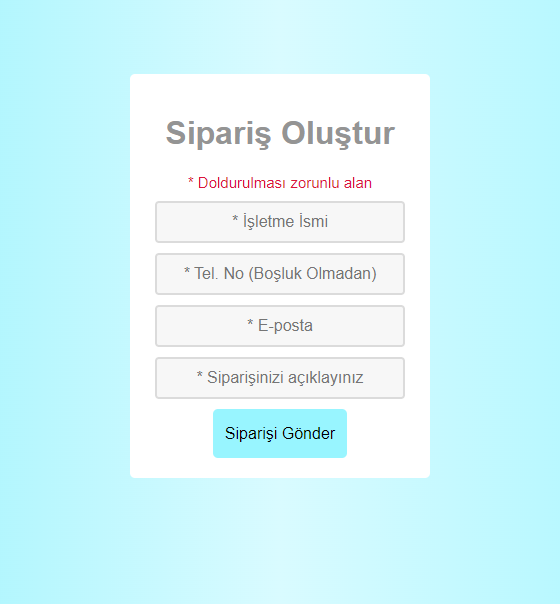
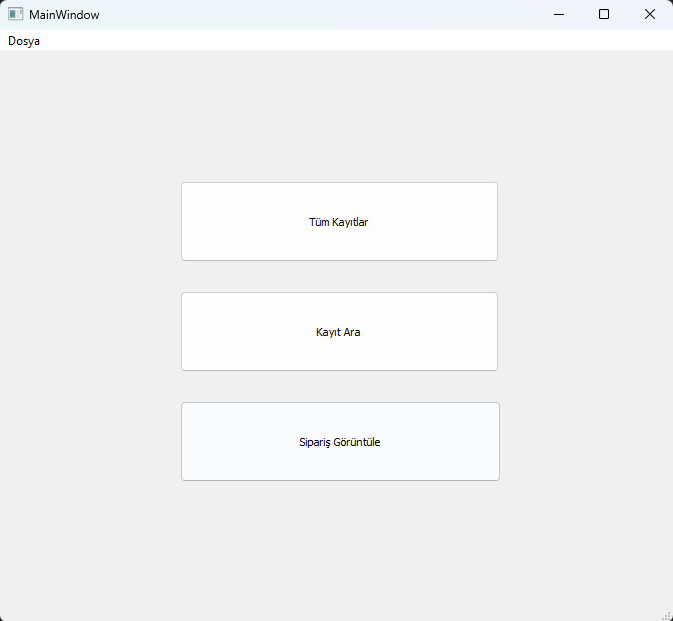

**TR: Küçük işletmeler için sipariş trafiğini azaltmak amaçlı kurulmuş sipariş alma sistemi. Siparişler web sitesi üzerinden gönderilir.
Müşterinin iletişim bilgileri ve sipariş isteğini içeren metin ile sipariş gönderilir (Bu içerik işletme türüne göre uyarlanabilir). İşletmeden de masaüstü uygulaması yoluyla siparişler görüntülenir.**
  
**EN: An order placement system with the aim of reducing order traffic for small businesses. Orders are submitted through the website.
Orders are submitted with a text containing the customer's contact information and order request (This content can be customized according to the type of business). Orders are viewed from the desktop application on the business side.**
   
Web Safyası:

  
Anasayfa Ekranı:

  
